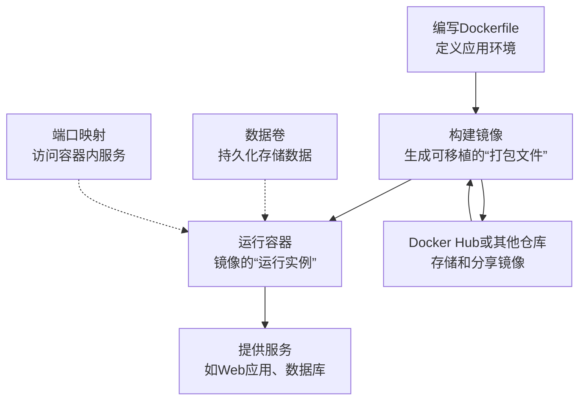

Docker是一个开源的容器化平台，它能让开发者将应用及其依赖环境一起打包，实现"一次构建，随处运行"。使用Docker可以帮你彻底解决令人头疼的"在我电脑上能跑"的问题。

下面这个流程图可以帮你快速理解Docker的核心工作方式：


接下来，我们通过几个步骤，快速上手Docker。

### 🚀 第一步：安装与配置

在不同操作系统上安装Docker的方式略有不同：

-   **Linux (以Ubuntu为例)**：推荐使用官方脚本一键安装，非常方便。
    ```bash
    curl -fsSL https://get.docker.com | sh
    ```
    安装后，为了每次使用`docker`命令时不用加`sudo`，可以将当前用户添加到`docker`用户组：
    ```bash
    sudo usermod -aG docker $USER
    newgrp docker
    ```

-   **Windows / macOS**：直接下载并安装 **Docker Desktop** 即可。在Windows上，建议开启**WSL 2**后端以获得更好的性能。

-   **配置镜像加速（国内用户强烈推荐）**：由于网络原因，拉取官方镜像可能很慢。配置一个国内的镜像加速器能极大提升速度。
    ```bash
    # 创建或修改 /etc/docker/daemon.json 文件
    sudo tee /etc/docker/daemon.json <<-'EOF'
    {
      "registry-mirrors": ["https://registry.docker-cn.com"]
    }
    EOF
    sudo systemctl restart docker
    ```

### 🐳 第二步：掌握核心命令（容器与镜像）

Docker的操作围绕两个核心概念：**镜像**和**容器**。镜像是一个只读的模板，而容器是镜像运行的实例。

这里整理了一份最常用的命令速查表，可以帮你快速上手：

| 操作类型 | 命令示例 | 说明 |
| :--- | :--- | :--- |
| **镜像操作** | `docker pull nginx:alpine` | 从仓库拉取一个轻量级的Nginx镜像。 |
| | `docker images` | 列出本地已下载的所有镜像。 |
| | `docker rmi nginx:alpine` | 删除指定的镜像。 |
| **容器操作** | `docker run -d --name my-nginx -p 8080:80 nginx` | **最常用的命令**，创建并后台运行一个名为`my-nginx`的容器，并将主机的8080端口映射到容器的80端口。 |
| | `docker ps` | 查看当前正在运行的容器。 |
| | `docker stop my-nginx` | 停止一个运行中的容器。 |
| | `docker start my-nginx` | 启动一个已停止的容器。 |
| | `docker rm -f my-nginx` | 强制删除一个容器（即使是运行状态）。 |
| **调试与运维** | `docker logs -f my-nginx` | 实时查看容器的日志，对排查问题很有帮助。 |
| | `docker exec -it my-nginx /bin/bash` | **进入容器内部**，像一个虚拟机一样进行调试。 |
| | `docker stats` | 实时查看容器的CPU、内存等资源占用情况。 |

### 🏗️ 第三步：构建自定义镜像 (Dockerfile)

如果公共仓库的镜像无法满足需求，你可以通过编写`Dockerfile`来创建自己的镜像。`Dockerfile`是一个文本文件，里面包含了一条条构建指令。

以部署一个简单的Python应用为例：

```dockerfile
# 使用官方Python基础镜像
FROM python:3.9-slim

# 设置容器内的工作目录
WORKDIR /app

# 将本地的依赖文件复制到容器内
COPY requirements.txt .

# 运行命令安装依赖
RUN pip install --no-cache-dir -r requirements.txt

# 将应用代码复制到容器内
COPY . .

# 声明容器对外服务的端口
EXPOSE 5000

# 容器启动时执行的命令
CMD ["python", "app.py"]
```

在`Dockerfile`所在目录下，执行以下命令即可构建镜像：
```bash
docker build -t my-python-app:v1 .
```
这个命令会打包当前目录下的内容，并按照`Dockerfile`的指令一步步构建出一个名为`my-python-app:v1`的镜像。

### 🗃️ 第四步：管理数据 (数据卷)

默认情况下，容器内产生的数据会随着容器的删除而消失。为了让重要数据（如数据库文件）持久化保存，需要使用**数据卷**，将容器内的目录挂载到宿主机上。

例如，运行一个MySQL容器并持久化数据：
```bash
docker run -d \
  --name mysql-db \
  -e MYSQL_ROOT_PASSWORD=my-secret-pw \
  -v mysql_data:/var/lib/mysql \ # 创建一个名为mysql_data的数据卷，挂载到容器内的数据目录
  -p 3306:3306 \
  mysql:8.0
```
即使删除这个MySQL容器，数据卷`mysql_data`里的数据也会被保留，下次可以挂载到新容器上。

### 🧩 第五步：编排多容器应用 (Docker Compose)

对于复杂的应用（比如一个Web应用需要同时依赖MySQL和Redis），手动运行多个容器并管理它们的网络会变得繁琐。这时，就可以使用**Docker Compose**，通过一个`docker-compose.yml`文件来定义和运行整个应用栈。

一个Java Spring Boot应用配合MySQL和Redis的`docker-compose.yml`示例：
```yaml
version: '3.8'
services:
  mysql:
    image: mysql:8.0
    environment:
      MYSQL_ROOT_PASSWORD: root
      MYSQL_DATABASE: demo_db
    volumes:
      - mysql_data:/var/lib/mysql
    ports:
      - "3306:3306"

  redis:
    image: redis:alpine
    ports:
      - "6379:6379"

  app:
    image: openjdk:17 # 或者 build: . 从本地Dockerfile构建
    depends_on:       # 确保依赖的服务先启动
      - mysql
      - redis
    volumes:
      - ./app.jar:/app/app.jar # 挂载本地的jar包
    working_dir: /app
    command: ["java", "-jar", "app.jar"]
    ports:
      - "8080:8080"

volumes:
  mysql_data:
```
在包含该文件的目录下，执行 `docker-compose up -d` 即可一键启动所有服务。

### 💡 总结与学习路径

通过以上五个步骤，你已经掌握了Docker的核心用法。回顾一下：

1.  **安装配置**是基础。
2.  **核心命令** (`run`, `ps`, `exec`, `logs` 等) 是日常操作的基石。
3.  **Dockerfile** 让你拥有构建自定义环境的"配方"。
4.  **数据卷** 解决了数据持久化的关键问题。
5.  **Docker Compose** 则帮你轻松管理复杂的多容器应用。

恭喜，现在你已经具备了使用Docker进行现代化应用部署的基本能力！如果在实践中遇到任何具体问题，比如某个命令报错，或者想了解如何容器化特定类型的应用，随时可以再来问我。