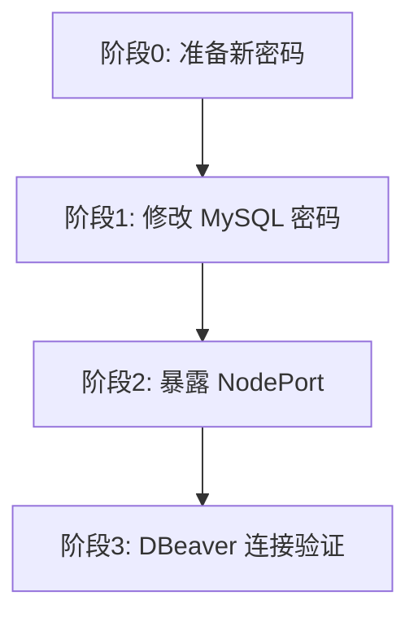

下面是一份可直接照做的**执行计划**，涵盖：**方案三（NodePort 暴露 MySQL）** 和 **修改 MySQL 密码**。

---

## 一、当前环境摘要

| 项目 | 当前值 |
|------|--------|
| 机器 IP | `22.50.100.13` |
| MySQL 服务 | `clawmanager-system/mysql`（ClusterIP，仅集群内） |
| 数据库 | `clawmanager` |
| 应用用户 | `clawmanager` / `clawreef123` |
| root 用户 | `root` / `root123` |
| 依赖该密码的服务 | `clawmanager-app`、`mysql` Deployment |
| 防火墙已开放端口 | `22`（SSH）、`30443`（前端） |
| MySQL 尚未对外暴露 | 需要改 NodePort + 开防火墙 |

---

## 二、执行顺序总览

建议分两个阶段，**先改密码，再暴露 NodePort**（避免旧密码在网络上暴露）：



| 阶段 | 内容 | 预计耗时 |
|------|------|----------|
| 阶段 0 | 准备新密码、SSH 登录服务器 | 5 分钟 |
| 阶段 1 | 改库内密码 → 更新 Secret → 重启应用 | 10 分钟 |
| 阶段 2 | Service 改 NodePort → 防火墙放行 | 5 分钟 |
| 阶段 3 | DBeaver 测试连接 | 5 分钟 |

---

## 三、阶段 0：准备工作

### 1. SSH 登录服务器

```bash
ssh your_user@22.50.100.13
```

### 2. 定义新密码（请自行替换为强密码）

```bash
# 应用连接用
export NEW_MYSQL_PASSWORD='caiwuClawManager_2026!'

# root 管理用（可与上面不同）
export NEW_MYSQL_ROOT_PASSWORD='caiwuClawManager_2026!'
```

### 3. 确认 MySQL 正常运行

```bash
kubectl get pods -n clawmanager-system -l app=mysql
kubectl get svc mysql -n clawmanager-system
```

预期：`mysql` Pod 为 `Running`，Service 类型为 `ClusterIP`。

---

## 四、阶段 1：修改 MySQL 密码

> **重要**：`clawmanager-app` 从 Secret `clawmanager-secrets` 读取 `mysql-password`。只改库内密码或只改 Secret 都会导致应用连不上，必须**三步一起做**。

### 步骤 1.1：在 MySQL 内修改用户密码

```bash
kubectl exec -n clawmanager-system deploy/mysql -- sh -c "
mysql -uroot -p\"\$MYSQL_ROOT_PASSWORD\" -e \"
ALTER USER 'clawmanager'@'%' IDENTIFIED BY '${NEW_MYSQL_PASSWORD}';
ALTER USER 'root'@'%' IDENTIFIED BY '${NEW_MYSQL_ROOT_PASSWORD}';
ALTER USER 'root'@'localhost' IDENTIFIED BY '${NEW_MYSQL_ROOT_PASSWORD}';
FLUSH PRIVILEGES;
\"
"
```

### 步骤 1.2：更新 Kubernetes Secret

```bash
kubectl patch secret clawmanager-secrets -n clawmanager-system \

--type merge \

-p '{"stringData":{"mysql-password":"caiwuClawManager_2026!","mysql-root-password":"caiwuClawManager_2026!"}}'
```

验证 Secret 已更新（只显示 key 名，不显示明文）：

```bash
kubectl get secret clawmanager-secrets -n clawmanager-system -o go-template='{{range $k,$v := .data}}{{$k}}{{"\n"}}{{end}}'
```

### 步骤 1.3：重启依赖该密码的服务

```bash
kubectl rollout restart deployment/clawmanager-app -n clawmanager-system
kubectl rollout restart deployment/mysql -n clawmanager-system

kubectl rollout status deployment/clawmanager-app -n clawmanager-system --timeout=120s
kubectl rollout status deployment/mysql -n clawmanager-system --timeout=120s
```

> 重启 `mysql` 是为了让 Pod 内环境变量与 Secret 一致，保证健康检查（`mysqladmin ping`）正常。

### 步骤 1.4：验证密码修改成功

```bash
# 验证应用用户
kubectl exec -n clawmanager-system deploy/mysql -- sh -c \
  "mysql -uclawmanager -p'${NEW_MYSQL_PASSWORD}' -e 'SHOW DATABASES;'"

# 验证 root
kubectl exec -n clawmanager-system deploy/mysql -- sh -c \
  "mysql -uroot -p'${NEW_MYSQL_ROOT_PASSWORD}' -e 'SELECT 1;'"

# 验证应用 Pod 正常
kubectl get pods -n clawmanager-system -l app=clawmanager-app
kubectl logs -n clawmanager-system deploy/clawmanager-app --tail=20
```

**回滚（若应用起不来）**：

```bash
# 用旧密码重新执行 1.1 ~ 1.3，Secret 改回 clawreef123 / root123
```

---

## 五、阶段 2：方案三 — 暴露 MySQL 为 NodePort

### 步骤 2.1：将 Service 改为 NodePort

```bash
kubectl patch svc mysql -n clawmanager-system -p '{"spec":{"type":"NodePort"}}'
```

### 步骤 2.2：查看分配的 NodePort

```bash
kubectl get svc mysql -n clawmanager-system
```

示例输出：

```
NAME    TYPE       CLUSTER-IP     EXTERNAL-IP   PORT(S)          AGE
mysql   NodePort   10.43.25.134   <none>        3306:30XXX/TCP   14d
```

记下 `30XXX`（K3s 默认 NodePort 范围 `30000-32767`）。

### 步骤 2.3：防火墙放行 NodePort

当前防火墙**未**开放 MySQL 端口，必须手动添加（将 `30XXX` 换成上一步实际端口）：

```bash
# 查看当前规则
sudo firewall-cmd --list-all

# 永久放行 NodePort（示例：30306）
sudo firewall-cmd --permanent --add-port=30XXX/tcp
sudo firewall-cmd --reload

# 确认
sudo firewall-cmd --list-ports
```

### 步骤 2.4：从本机测试连通性

在你**本地电脑**执行（替换实际 NodePort）：

```bash
nc -zv 22.50.100.13 30XXX
# 或
telnet 22.50.100.13 30XXX
```

若不通，检查：NodePort 是否正确、防火墙是否 reload、云厂商安全组是否放行该端口。

---

## 六、阶段 3：DBeaver 连接配置

在 DBeaver 中新建 **MySQL** 连接：

| 配置项 | 值 |
|--------|-----|
| Host | `22.50.100.13` |
| Port | 步骤 2.2 中的 NodePort（如 `30306`） |
| Database | `clawmanager` |
| Username | `clawmanager` |
| Password | 阶段 1 设置的 `NEW_MYSQL_PASSWORD` |

**Driver properties**（MySQL 8 常见问题）：

| 属性 | 值 |
|------|-----|
| `allowPublicKeyRetrieval` | `true` |
| `useSSL` | `false` |

点击 **Test Connection** → **Finish**。

日常管理可用 root 账号（`NEW_MYSQL_ROOT_PASSWORD`），日常开发建议只用 `clawmanager` 用户。

---

## 七、安全建议（强烈建议执行）

NodePort 会把数据库暴露到网络，建议至少做以下限制：

### 1. 限制来源 IP（推荐）

只允许你的办公网/本机 IP 访问 NodePort：

```bash
# 示例：仅允许 192.168.1.100 访问 30306
sudo firewall-cmd --permanent --add-rich-rule='rule family="ipv4" source address="192.168.1.100/32" port port="30XXX" protocol="tcp" accept'
sudo firewall-cmd --reload
```

### 2. 不要使用弱密码

阶段 1 的新密码建议：16 位以上，含大小写、数字、特殊字符。

### 3. 生产环境可考虑改回 ClusterIP

临时调试完成后，若不再需要外部直连：

```bash
kubectl patch svc mysql -n clawmanager-system -p '{"spec":{"type":"ClusterIP"}}'
sudo firewall-cmd --permanent --remove-port=30XXX/tcp
sudo firewall-cmd --reload
```

---

## 八、一键脚本（可选，便于快速执行）

可将阶段 1 + 2 合并为脚本（执行前确认密码和权限）：

```bash
#!/bin/bash
set -euo pipefail

NS=clawmanager-system
NEW_MYSQL_PASSWORD='YourStrongAppPassword_2026!'
NEW_MYSQL_ROOT_PASSWORD='YourStrongRootPassword_2026!'

echo "=== 1. 修改 MySQL 用户密码 ==="
kubectl exec -n $NS deploy/mysql -- sh -c "
mysql -uroot -p\"\$MYSQL_ROOT_PASSWORD\" -e \"
ALTER USER 'clawmanager'@'%' IDENTIFIED BY '${NEW_MYSQL_PASSWORD}';
ALTER USER 'root'@'%' IDENTIFIED BY '${NEW_MYSQL_ROOT_PASSWORD}';
ALTER USER 'root'@'localhost' IDENTIFIED BY '${NEW_MYSQL_ROOT_PASSWORD}';
FLUSH PRIVILEGES;
\"
"

echo "=== 2. 更新 Secret ==="
kubectl patch secret clawmanager-secrets -n $NS \
  --type merge \
  -p "{\"stringData\":{\"mysql-password\":\"${NEW_MYSQL_PASSWORD}\",\"mysql-root-password\":\"${NEW_MYSQL_ROOT_PASSWORD}\"}}"

echo "=== 3. 重启应用 ==="
kubectl rollout restart deployment/clawmanager-app -n $NS
kubectl rollout restart deployment/mysql -n $NS
kubectl rollout status deployment/clawmanager-app -n $NS --timeout=120s
kubectl rollout status deployment/mysql -n $NS --timeout=120s

echo "=== 4. 暴露 NodePort ==="
kubectl patch svc mysql -n $NS -p '{"spec":{"type":"NodePort"}}'
NODEPORT=$(kubectl get svc mysql -n $NS -o jsonpath='{.spec.ports[0].nodePort}')
echo "NodePort: $NODEPORT"

echo "=== 5. 防火墙放行（需 sudo）==="
sudo firewall-cmd --permanent --add-port=${NODEPORT}/tcp
sudo firewall-cmd --reload

echo "=== 完成 ==="
echo "DBeaver 连接: Host=22.50.100.13 Port=${NODEPORT} DB=clawmanager User=clawmanager"
```

---

## 九、验收清单

- [ ] `clawmanager-app` Pod 状态为 `Running`，日志无数据库连接错误
- [ ] 用新密码在 Pod 内 `mysql` 登录成功
- [ ] `kubectl get svc mysql` 显示 `NodePort` 及端口
- [ ] 防火墙已放行对应 NodePort
- [ ] 本地 `nc/telnet` 能连通 `22.50.100.13:NodePort`
- [ ] DBeaver **Test Connection** 成功
- [ ] 旧密码 `clawreef123` / `root123` 已无法登录

---

如果你希望我在服务器上**直接帮你执行**这两步，请发我：

1. 新的 `clawmanager` 用户密码  
2. 新的 `root` 密码  
3. 是否需要限制访问 IP（以及允许的 IP 段）

我可以按你的密码代你执行并回报 NodePort 和 DBeaver 最终连接参数。